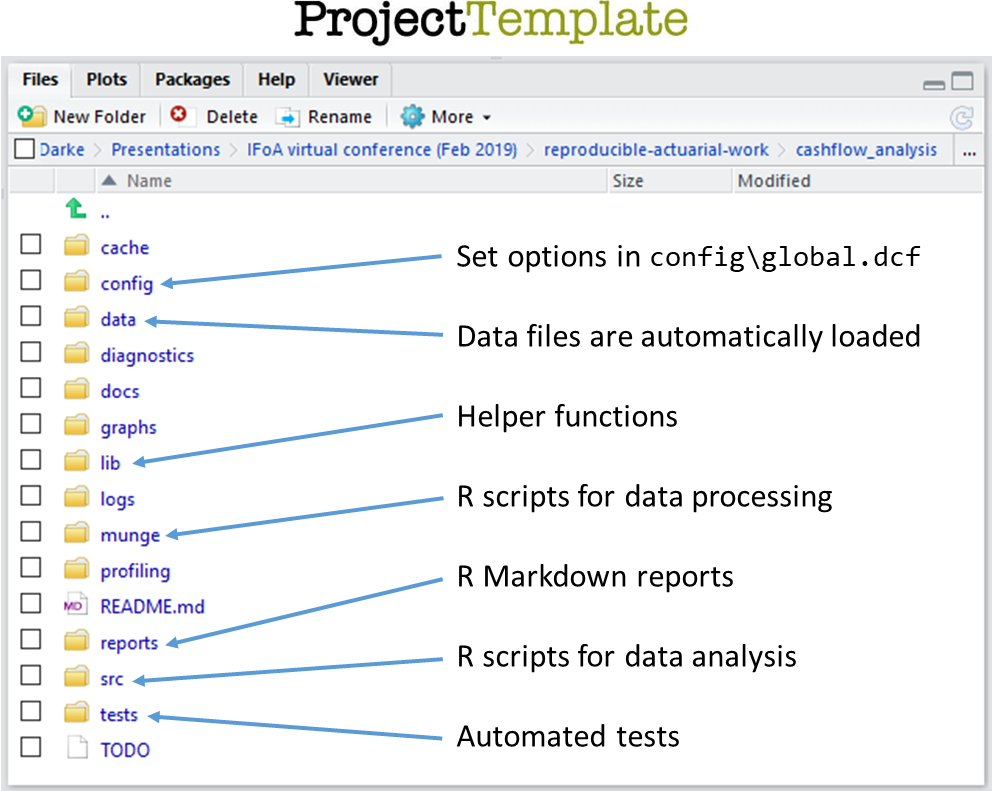

<style type="text/css" media="screen">
  img {
    width: 80%;
  }
</style>

[ProjectTemplate](http://projecttemplate.net/) provides a system for automating the menial parts of a data analysis project such as organising files and loading/processing data.

To install ProjectTemplate and create a new project called `cashflow_analysis` run the following code in the console

```R
> # Install ProjectTemplate
> install.packages("ProjectTemplate")

> # Load ProjectTemplate and create a new project called cashflow_analysis
> library("ProjectTemplate")
> create.project("cashflow_analysis")
```

This creates a new directory called `cashflow_analysis` in your RStudio working directory.  Switch to this directory (navigate to it in the Files pane and select `More / Set As Working Directory`) and you will see the following project structure.

<a href="assets/images/projecttemplate.png"></a>

The following exercises will illustrate how you can use these directories to structure your analysis.  You can read more about the project structure [here](http://projecttemplate.net/architecture.html).


